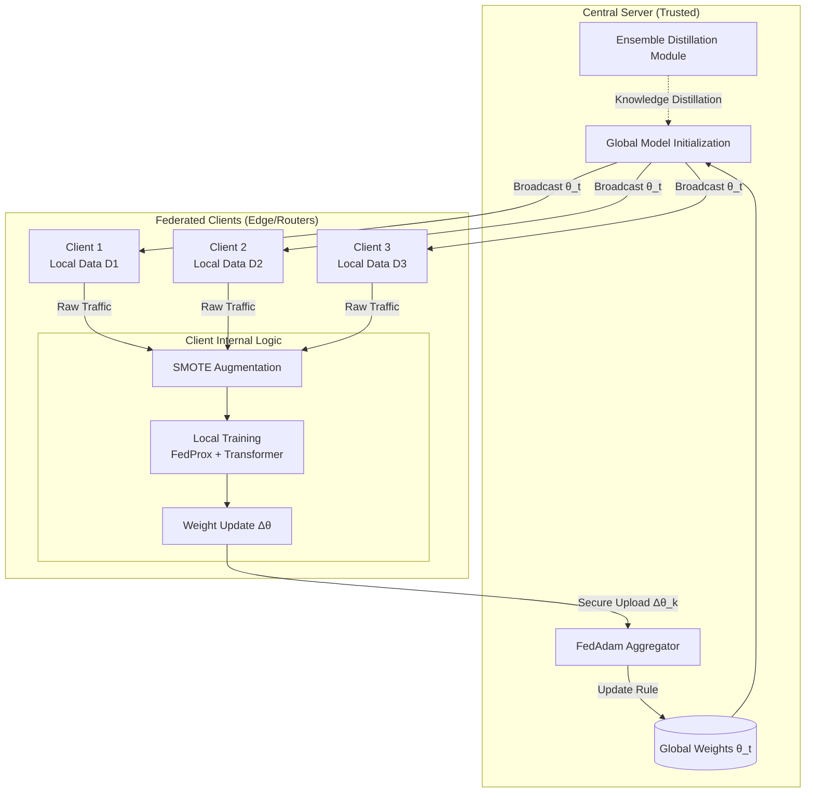
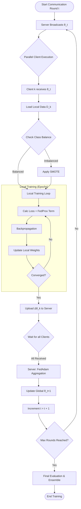

# Chapter 3: Methodology

## 3.1 Overview
This research proposes a novel **Privacy-Preserving Intrusion Detection System (IDS)** leveraging **Federated Learning (FL)**. Unlike traditional centralized IDS that requires aggregating sensitive network traffic logs, our approach trains models locally on distributed clients (e.g., edge routers, enterprise servers) and aggregates only model weights.

The proposed architecture, termed **FedTrans-Ensemble**, integrates four key innovations to address the challenges of class imbalance, non-IID data distribution, and complex attack patterns in the NSL-KDD dataset:
1.  **Transformer-Based Feature Extraction:** Utilizing Multi-Head Self-Attention to capture global dependencies in network flows.
2.  **Adaptive Federated Optimization:** Employing **FedAdam** to stabilize convergence across heterogeneous client data.
3.  **Local Data Augmentation:** Applying **SMOTE** at the client level to synthesize minority attack classes.
4.  **Federated Ensemble Distillation:** Aggregating predictions from diverse architectures (MLP, GNN, Transformer) to maximize detection accuracy.

## 3.2 System Architecture

The system follows a **Star Topology** consisting of a central coordination server and $K$ distributed clients.

### 3.2.1 Architectural Components
1.  **Central Server (Aggregator):**
    *   Initializes the global model parameters $\theta_0$.
    *   Orchestrates communication rounds.
    *   Performs **Weighted Averaging** using the FedAdam optimizer.
    *   Hosts the **Ensemble Teacher** for knowledge distillation.
2.  **Federated Clients ($C_1, C_2, ..., C_K$):**
    *   Possess local private datasets $D_k$ (Non-IID).
    *   Perform local preprocessing (One-Hot Encoding, Standard Scaling).
    *   Apply **SMOTE** to balance local training batches.
    *   Execute local training using **FedProx** regularization to prevent client drift.
    *   Upload updated weights $\Delta \theta_k$ to the server.

### 3.2.2 Architecture Diagram
*Copy the code below into [mermaid.live](https://mermaid.live) to generate the diagram.*



## 3.3 Data Preprocessing Pipeline

The NSL-KDD dataset undergoes a rigorous transformation pipeline before entering the neural networks.

### 3.3.1 Cleaning and Encoding
1.  **Column Removal:** The `difficulty_level` column is dropped as it introduces data leakage (it is derived from the label).
2.  **Label Binarization:** Labels are mapped to binary classes: `normal` $\to$ 0, and all attack types (DoS, Probe, R2L, U2R) $\to$ 1.
3.  **Categorical Encoding:** Features `protocol_type`, `service`, and `flag` are transformed using **One-Hot Encoding**.
4.  **Normalization:** All numerical features are standardized using **Z-Score Normalization** ($\mu=0, \sigma=1$) to ensure gradient stability.

### 3.3.2 Graph Construction (For FedGNN)
For the Graph Neural Network branch, tabular data is converted into a graph structure $G=(V, E)$:
*   **Nodes ($V$):** Each network flow sample is a node.
*   **Edges ($E$):** Constructed using **k-Nearest Neighbors (k-NN)** based on Euclidean distance in feature space, connecting similar traffic patterns.

## 3.4 Proposed Algorithms

### 3.4.1 Local Client Training with SMOTE & FedProx
To handle class imbalance and Non-IID data, clients minimize the following objective function at round $t$:

$$ L_k(\theta) = \underbrace{\mathcal{L}_{CE}(y, \hat{y})}_{\text{Cross Entropy}} + \underbrace{\frac{\mu}{2} ||\theta - \theta_{global}||^2}_{\text{FedProx Regularization}} $$

Where $\mu$ is the proximal term controlling the deviation from the global model. Before training, SMOTE synthesizes $N_{syn}$ samples for the minority class:
$$ x_{new} = x_i + \lambda \cdot (x_{zi} - x_i) $$
Where $x_{zi}$ is a random k-nearest neighbor of $x_i$.

### 3.4.2 Adaptive Server Aggregation (FedAdam)
Instead of simple averaging (FedAvg), the server uses **FedAdam** to adaptively update the global model based on momentum and variance of client updates:

1.  **Aggregate Updates:** $g_t = \sum_{k=1}^K \frac{n_k}{n} \Delta \theta_k$
2.  **Update Momentum:** $m_t = \beta_1 m_{t-1} + (1-\beta_1)g_t$
3.  **Update Variance:** $v_t = \beta_2 v_{t-1} + (1-\beta_2)g_t^2$
4.  **Global Step:** $\theta_{t+1} = \theta_t - \eta \cdot \frac{m_t}{\sqrt{v_t} + \epsilon}$

## 3.5 Use Case Diagram
*Describes the interactions between actors and the system.*

```mermaid
usecaseDiagram
    actor "Network Administrator" as Admin
    actor "Malicious Attacker" as Attacker
    package "Federated IDS System" {
        usecase "Initialize Global Model" as UC1
        usecase "Partition Data Locally" as UC2
        usecase "Apply SMOTE Augmentation" as UC3
        usecase "Train Local Transformer" as UC4
        usecase "Aggregate Weights (FedAdam)" as UC5
        usecase "Detect Intrusions" as UC6
        usecase "Visualize Metrics" as UC7
        usecase "Launch DDoS/Probe Attack" as UC8
    }

    Admin --> UC1
    Admin --> UC7
    Admin --> UC6
    
    UC1 ..> UC2 : Includes
    UC2 ..> UC3 : Includes
    UC3 ..> UC4 : Triggers
    UC4 ..> UC5 : Sends Updates
    UC5 ..> UC1 : Updates Global Model
    
    Attacker --> UC8
    UC8 ..> UC6 : Detected By
```

## 3.6 Activity Diagram (Workflow)
*Illustrates the step-by-step flow of one communication round.*



## 3.7 Experimental Setup

### 3.7.1 Dataset
*   **Source:** NSL-KDD (Train+: 125,973 records, Test+: 22,544 records).
*   **Split:** Data is partitioned among $K=5$ clients using Non-IID distribution (sharded by label to simulate realistic heterogeneity).

### 3.7.2 Hyperparameters
| Parameter | Value | Description |
| :--- | :--- | :--- |
| **Clients ($K$)** | 5 | Number of simulated edge nodes |
| **Communication Rounds** | 50 | Global aggregation steps |
| **Local Epochs** | 5 | Training iterations per client per round |
| **Batch Size** | 64 | Samples per gradient update |
| **Learning Rate ($\eta$)** | 0.001 | Initial step size |
| **FedProx ($\mu$)** | 0.01 | Regularization strength |
| **FedAdam ($\beta_1, \beta_2$)** | 0.9, 0.99 | Momentum coefficients |
| **SMOTE Ratio** | 1:1 | Target balance for minority class |

### 3.7.3 Evaluation Metrics
Performance is evaluated using:
1.  **Accuracy:** Overall correctness.
2.  **Precision & Recall:** Critical for measuring False Positives and False Negatives in security.
3.  **F1-Score:** Harmonic mean of Precision and Recall (primary metric for imbalance).
4.  **Confusion Matrix:** Visual breakdown of TN, TP, FN, FP.
5.  **Convergence Speed:** Rounds required to reach stable loss.

## 3.8 Summary
This methodology establishes a robust framework for privacy-preserving intrusion detection. By combining the representational power of **Transformers**, the stability of **FedAdam**, and the generalization capability of **Ensemble Distillation**, the proposed system aims to outperform traditional centralized and federated baselines in both accuracy and robustness against imbalanced cyber threats.
